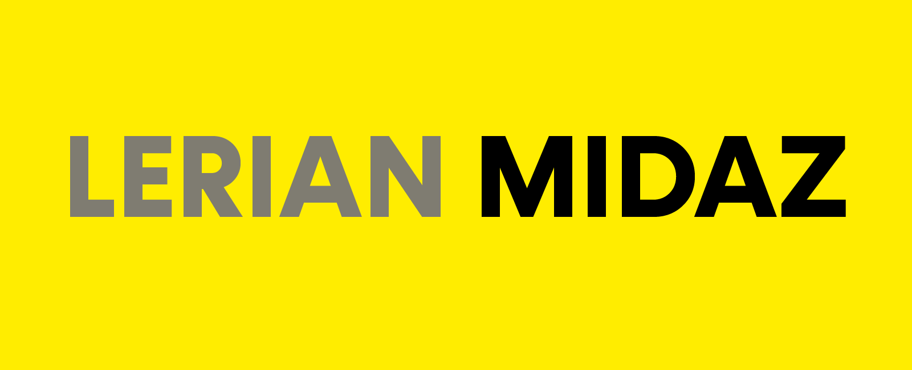

# Lerian Studio Helm Charts

### Midaz Helm Chart 

📚 For more details, check out the [official documentation](https://docs.lerian.studio/docs/deploy-midaz-using-helm).

🛠️ Looking for implementation and configuration details? See the [README](https://charts.lerian.studio/charts/midaz).

-----------------
### Plugin Access Manager Helm Chart    

📚 For more details, check out the [official documentation](https://docs.lerian.studio/docs/auth-identity).

🛠️ Looking for implementation and configuration details? See the [README](https://charts.lerian.studio/charts/plugin-access-manager).

-----------------

### Plugin CRM Helm Chart

📚 For more details, check out the [official documentation](https://docs.lerian.studio/docs/crm).

🛠️ Looking for implementation and configuration details? See the [README](https://charts.lerian.studio/charts/plugin-crm).

-----------------

### Plugin Fees Helm Chart

📚 For more details, check out the [official documentation](https://docs.lerian.studio/docs/fee-engine).

🛠️ Looking for implementation and configuration details? See the [README](https://charts.lerian.studio/charts/plugin-fees).

