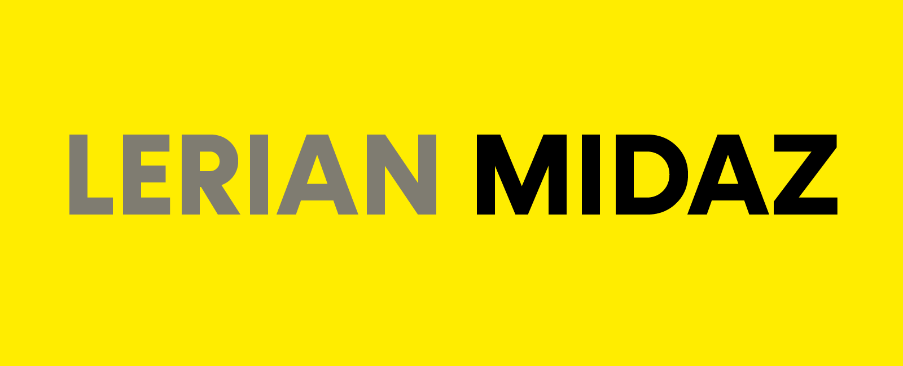

# Lerian Studio Helm Charts

## Chart Maintenance

- Chart contract: [`docs/helm-chart-standard.md`](docs/helm-chart-standard.md)
- Render inventory (on demand): `cd .github/scripts && go run ./validate-helm-charts --root ../.. --render-inventory --output /tmp/helm-render-inventory.md`
- Static validation: `cd .github/scripts && go run ./validate-helm-charts --root ../.. --strict`
- Render validation: `cd .github/scripts && go run ./validate-helm-charts --root ../.. --render-gate --all`

CI enforces the static contract and render gate. Required production secrets are represented by dummy sample values under `.github/configs/helm-render-values/` only so charts can render in CI without publishing credentials.

> **Maintenance line.** This branch is the `9.2.x` chart line of `midaz`,
> serving the app's `4.0.x` maintenance line — the chart and app numbers do not
> match, and the binding lives in the chart's `appVersion`. Only this chart is released from here;
> the other charts in the tree are a frozen snapshot. Mainline charts live on the default branch.

### Midaz Helm Chart

See the [official documentation](https://docs.lerian.studio/en/midaz/deploy-midaz-using-helm) for deployment guides.

For implementation and configuration details, see the [README](https://charts.lerian.studio/charts/midaz).

#### Application Version Mapping

| Chart Version | Ledger Version | CRM Version |
| :---: | :---: | :---: |
| `9.0.0` | 3.8.3 | 3.8.2 |
-----------------
